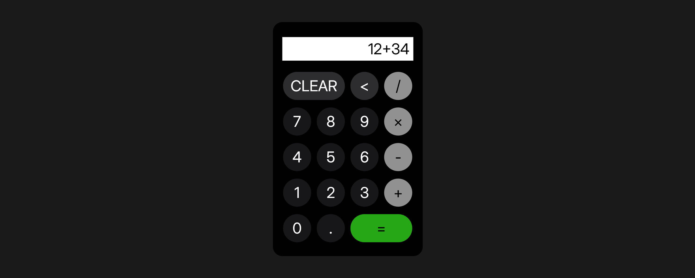
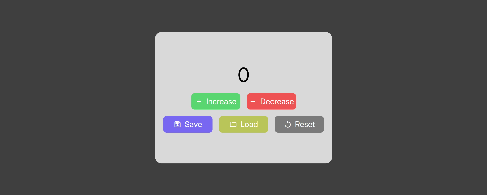
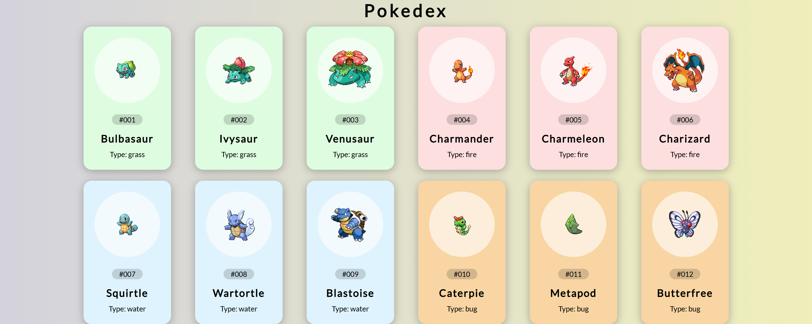
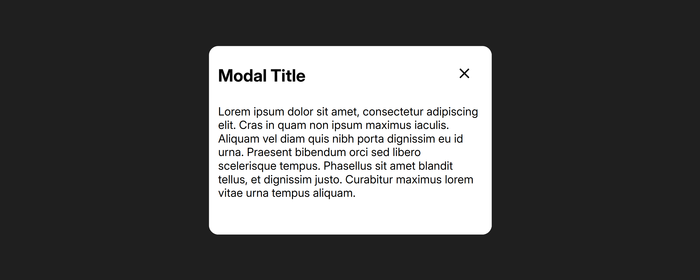

#  JS Projects

  Projetos feitos em Javascript, clique em um projeto para acessá-lo.

  

   
  <a href="https://www.figma.com/design/JL2OZx9RRWne947eEJRQdk/js-projects?node-id=0-1&t=uzOv22YDuqroTwqd-1">
    Acesse o design dos projetos no figma (clique aqui)
  </a>

  

## Tecnologias utilizadas
<table>
  <tr>
    <td width="50">
      
    </td>
    <td>
      HTML: Estrutura da página web
    </td>
  </tr>

  <tr>
    <td width="50">
      
    </td>
    <td>
      CSS: Estilização da página web
    </td>
  </tr>

  <tr>
    <td width="50">
      
    </td>
    <td>
      JavaScript: Interatividade da página web
    </td>
  </tr>

</table>